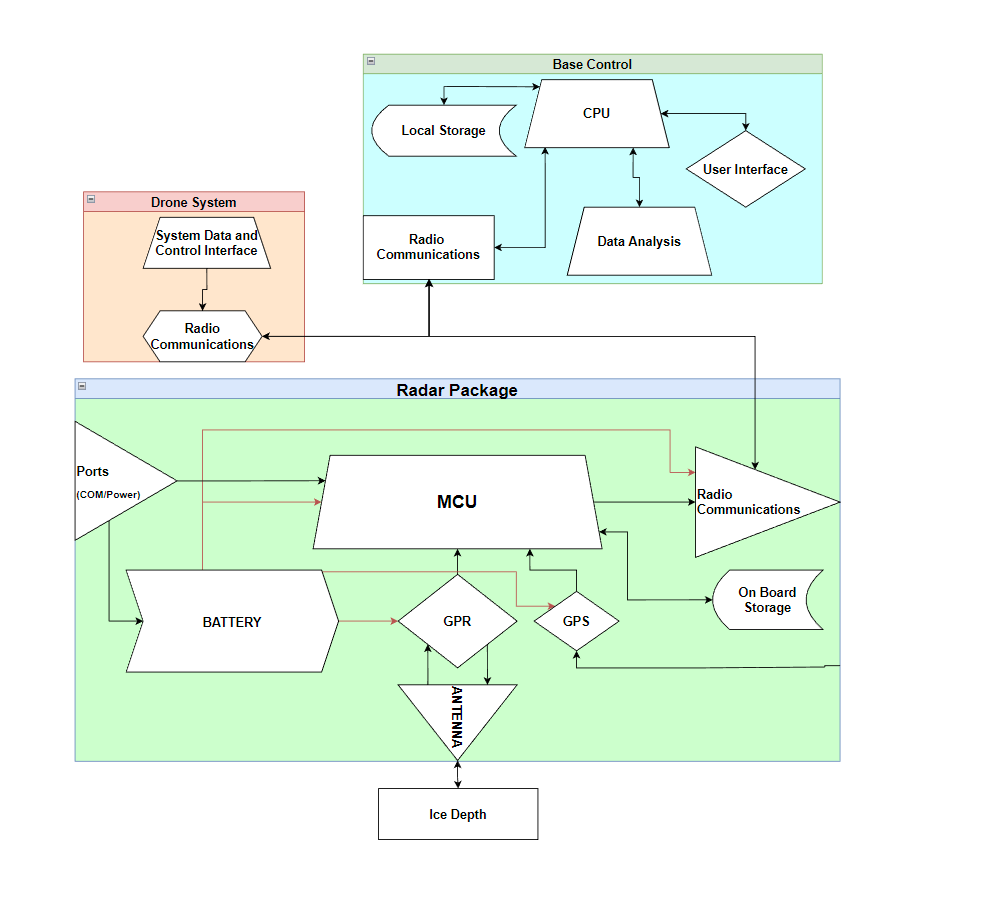
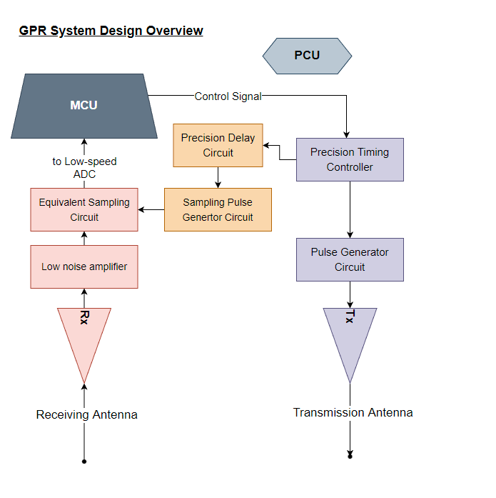
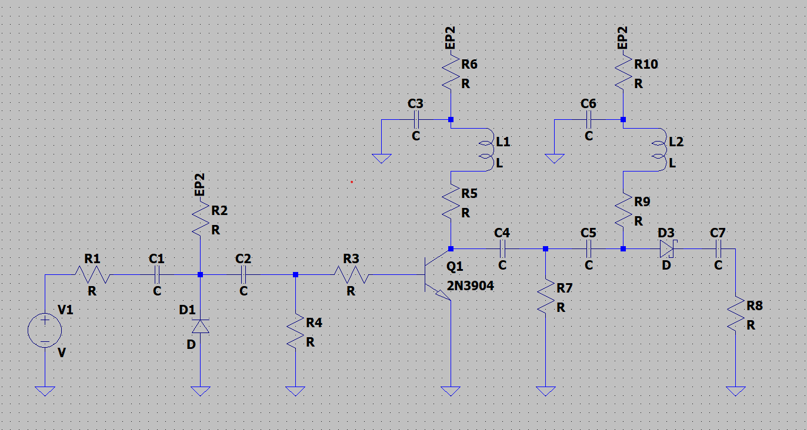
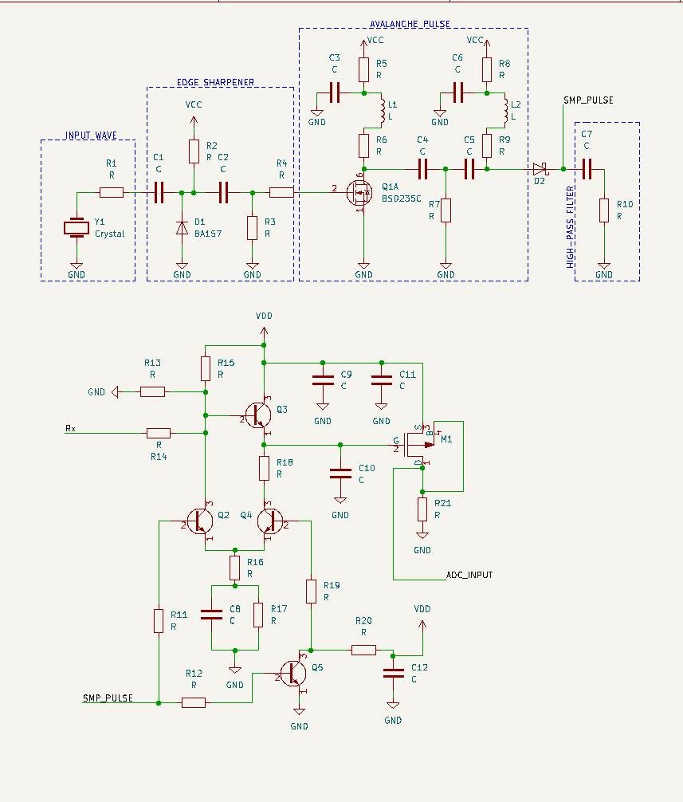

# DRONE-MOUNTED-GPR-SENSOR-PACKAGE
A feasibility study for a drone mounted, ice thickness mapping sensor array

See the Final_Report and Requirement_Specification for details.

Sample Images

  
 
 
